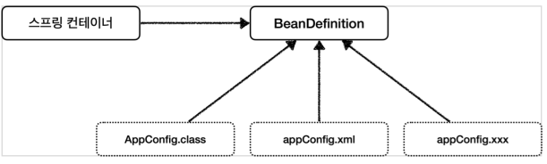
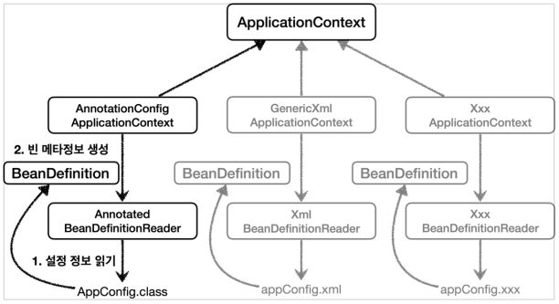

IoC 컨테이너와 빈      
========================  
# 📗 IoC
`IoC(inversion of control)`란, 이름 그대로 `제어의 역전`을 의미한다.    
               
**객체를 생성하고 관리하는 제어를 역전시키는 것**으로                
하나의 클래스에서 객체를 생성하고 사용하면서 관리하는 것이 아니라    
`객체의 생성`은 외부에 맡기고 `객체의 사용`만을 관리하는 것이다.        
그리고 외부에 맡긴다는 말은 **프레임워크에 빈을 생성하고 관리하는 제어권을 맡긴다는 것이다.**    
즉, **개발자는 프레임워크로부터 빈을 주입받아 사용하기만 하면 된다는 의미기도 하다.**      
  
* 프레임워크에 빈을 생성하고 관리하는 제어권을 맡긴다.     
* 개발자는 프레임워크로부터 빈을 주입받아 사용하기만 하면 된다.  

## 📖 IoC라는 개념이 도입되기 전
`IoC`라는 개념이 도입되기 전에는       
애플리케이션 수행에 필요한 **객체의 생성이나 객체와 객체 사이의 의존 관계를 개발자가 직접 처리했다.**       
그리고 이런 상황에서 **의존 관계에 있는 객체를 변경할 때, 반드시 코드를 수정해야 한다는 문제가 발생했다.**           
         
결과적으로 `SOLID 원칙`을 위배한 결합도 높은 코드를 작성하고 있었다.               
* `생성`과 `사용`이라는 2가지 책임이 있으므로 `SRP(단일 책임 원칙)` 위배       
* 기능의 확장이나 변경을 꾀한다면 코드를 수정해야하기에 `OCP(개방폐쇄원칙)` 위배   
   
## 📖 IoC가 적용되면서
  
개발자는 `생성`과 `사용`이라는 2가지 측면을 고려하지 않아도 되므로     
더 가독성이 좋고, 유지보수하기 편한 코드를 작성할 수 있게 되었다.   
   
* **객체 생성을 컨테이너(빈 컨테이너)가 대신 처리한다.**    
* **객체와 객체 사이의 의존관계 역시 컨테이너가 처리한다.**        
* **소스에 `의존 관계`가 명시되지 않으므로 결합도가 떨어져서 유지보수가 편리해진다.**      
     
     
# 📘 DI(Dependency injection)    
> 의존성 주입  
  
`DI(Dependency injection)`란, 이름 그대로 **의존 관계 주입(의존성 주입)** 을 의미한다.        
         
## 📖 의존 관계란 무엇일까?   
```
자동차는 내부적으로 타이어를 사용한다.   
즉, 타이어가 있어야 자동차가 존재한다.    
   
자동차 -> 타이어
```
```java
public class Car {
    Tier tier;
} 
```
`의존 관계`란, 일반적으로 `코드에서의 두 모듈 간의 연결`을 의미하지만,           
'객체 지향 언어'에서는 `두 클래스 간의 관계`라고도 말을 한다.            
쉽게 표현하면 **두 개의 연관된 클래스 중 하나가 다른 하나를 어떤 용도를 위해 사용하는 것을 말한다.**       
  
* `Car` 는 `Tier`를 가지고 있다.    
* `Tier`가 있어야 `Car`이다.         
* `Car` 는 `Tier`에 의존적이다.       
* 의존 관계 그래프 : `Car -> Tier`

의존 관계는 아래 2가지 종류가 있다.    
   
1. 정적인 클래스 의존관계       
2. 동적인 클래스 의존관계  
   
### 정적인 클래스 의존관계   
클래스가 사용하는 `import`만 보고도 의존 관계를 쉽게 판단할 수 있다.    
즉, 정적인 의존 관계는 애플리케이션을 실행하지 않아도 분석할 수 있다.         
   
```java
public class Car {
    HankookTier tier;
    
    public Car(HankookTier tier) {
        this.tier = tier;
    }
}
```
   
쉽게 설명하면 클래스 타입을 명확히 사용하는 경우를 말한다.             
클래스 타입을 명확히 사용한다는 말은 필자가 정의한 말로            
`추상화가 없는 클래스`나 `추상화의 하위 구현체`를 의미한다.           
**즉, 다형성을 이용할 수 없는 클래스를 의미한다.**           
       
다형성이 없다는 것이 나빠다는 것은 아니다.          
단순히, 다형성이 없으므로 `import`만 보고도      
어떤 클래스가 의존 관계를 맺을지 알 수 있다는 것을 말하고 싶다.        
   
### 동적인 클래스 의존관계      
`애플리케이션 실행 시점(Runtime)`에 실제 생성된 객체 인스턴스의 참조가 연결된 의존 관계다.         
즉, 컴파일 타임에서 어떤 객체가 의존 관계를 가질지는 모르지만  런타임에는 의존관계가 결정되는 것을 의미한다.      

```java
public class Main {
    public static void main(String[] args) {
        Car car = new Car(new HankookTier());
        Car car2 = new Car(new MichelinTier());
    }
}
```
```java
public class Car {
    Tier tier; // 변경이 일어나지 않는다.  
    
    public Car(Tier tier) {
        this.tier = tire;
    }
}
```

* `애플리케이션 실행 시점(런타임)`에      
  외부(Spring Container)에서 실제 구현 객체를 생성하고 클라이언트에 전달해서        
  클라이언트와 서버의 실제 의존 관계가 연결되는 것을 `의존 관계 주입(DI)`이라 말한다.               
* 인스턴스를 생성하고, 그 참조 값을 전달해서 연결된다.     
* 의존 관계 주입을 사용하면 클라이언트 코드를 변경하지 않고       
  클라이언트가 호출하는 대상의 타입 인스턴스를 변경할 수 있다.          
  이로 인해, SOLID의 5대 원칙중 하나인 OCP(개방폐쇄)원칙을 지킬 수 있다.        
  
## 📖 의존 관계 주입이란?              
의존 관계의 객체를 직접 생성하고 사용하는 것이 아니라,           
**이미 만들어진 의존 관계의 객체를 외부로부터 주입받아 사용하는 것을 말한다.**         
      
**IoC VS DI**   
* IoC : 객체의 제어권을 프레임워크에 맡긴다.       
* ID : 외부로부터, 생성된 객체를 주입받아 사용한다.     
             
**기존 코드**
```java
import me.kwj1270.javaapi.test.domain.SampleInstance;

public class StudyTest {

    SampleInstance sampleInstance = new SampleInstance();       // 객체의 생성 방법이 바뀌면 코드 수정해야함

    public void doLogic() {
        ...                                                     // 객체를 사용하는 코드 또한 영향을 받을 가능성이 있다.    
    }
}
```
일반적인 방식은, **객체를 `생성`하고 `사용`하는 `2가지 책임`이 존재한다.**        
                   
만약, 객체를 생성하는 과정에 변경사항이 생긴다고 가정을 한다면,     
객체를 생성하는 코드를 수정해야하는 것은 물론이고        
객체를 사용하는 코드 또한 수정하는 상황이 발생한다.             
                 
결국, 개발자는 객체의 `생성` 및 `사용`을 지속적으로 신경쓰면서 코딩해야하고                         
만약, 이를 잊어버리고 코드 수정을 누락하게 된다면, **잠재적으로 버그를 가지게 된다.**           
          
**생성과 관련된 코드**
```java
public class TestApplication {

    public static void main(String[] args) {
        SampleInstance sampleInstance = new SampleInstance();
        StudyTest studyTest = new StudyTest(sampleInstance);
    }
    
}
```
**사용과 관련된 코드**
```java
import me.kwj1270.javaapi.test.domain.SampleInstance;

public class StudyTest {

    private SampleInstance sampleInstance;                      // 객체의 생성 방법이 바뀌어도 영향이 없다.

    public StudyTest(SampleInstance sampleInstance) {
        this.sampleInstance = sampleInstance;
    }

    public void doLogic() {
        ...                                                     // 객체를 사용하는 코드는 영향을 받을 가능성이 있다.
    }
}
```
위와 같이 객체의 `생성`과 `사용`을 분리를 하게 된다면        
로직이 객체의 생성에 영향을 받는다하더라도,            
이제는 **`생성`을 제외한 `사용` 부분만 수정을 해주면 된다.**                    
              
보다 자세한 내용은 필자가 정리한 [클린코드 11장 시스템_제작과 사용을 분리하라](https://github.com/kwj1270/TIL_CleanCode/blob/master/11%20%EC%8B%9C%EC%8A%A4%ED%85%9C.md#%EC%A0%9C%EC%9E%91%EA%B3%BC-%EC%82%AC%EC%9A%A9%EC%9D%84-%EB%B6%84%EB%A6%AC%ED%95%98%EB%9D%BC)
을 참고하자.       
   
# 📕 스프링 IoC 컨테이너
스프링 IoC 컨테이너는 **✔BeanFactory**를 기반으로 구현된 구현체이다.         
애플리케이션 컴포넌트의 중앙 저장소의 역할을 맡고 있으며            
**✔빈 설정 소스**로 부터 **✔빈 정의**를 읽어들이고, 빈을 구성하고 제공한다.           
                  
## 📖 스프링 IoC(DI) 컨테이너 상세              
Spring은 '스프링 설정 및 '애플리케이션 구현'과 관련된 `빈(Bean)`들을 `Spring Container`에 저장한다.                      
그리고 이러한 `Spring Container`의 종류는 크게 2가지가 있다.    
       
1. BeanFactory    
2. ApplicationContext   

### 📄 BeanFactory     
스프링 설정 파일에 등록된 `Bean`을 생성하고 관리하는 가장 기본적인 컨테이너 기능만 제공한다.        
처음부터 객체를 생성하지 않고, 클라이언트의 요청(Lookup)에 의해서만 `Bean`이 생성되는 **지연로딩 방식을 사용한다.**        
일반적인 스프링 프로젝트에서 `BeanFactroy`를 사용할 일은 거의 없다.          
            
### 📄 ApplicationContext     
`BeanFactory`를 상속받고 있다. (인터페이스간의 상속, `HierarchicalBeanFactory`)       
이외에도 `ApplicationEventPublisher`, `EnvironmentCapable`,   `HierarchicalBeanFactory`, `ListableBeanFactory`,           
`MessageSource`, `ResourceLoader`, `ResourcePatternResolver`등의 인터페이스를 구현하고 있다.      
              
'컨테이너식'으로 동작하며 `빈 처리 로직`외에도       
`트랜잭션 관리`나 `리소스 로딩 기능` 그리고 `메시지 기반의 다국어 처리`과 같은 다양한 기능을 지원한다.          
        
**메시지 소스를 활용한 국제화 기능**         
한국에서 들어오면 한국어로, 영어권에서 들어오면 영어로         
출력 파일을 여러 개로 분리해서 들어온 IP에 따라 알맞는 언어로 처리한다.        
   
* **환경변수**     
  로컬, 개발, 운영등을 구분해서 처리   
* **애플리케이션 이벤트**          
  이벤트를 발행하고 구독하는 모델을 편리하게 지원  
* **편리한 리소스 조회**         
  파일, 클래스패스, 외부 등에서 리소스를 편리하게 조회    
                     
`BeanFactory` 같은 경우, 빈을 관리하는 기본적인 역할만 수행하기에               
**대부분의 스프링 프로젝트는 `ApplicationContext` 유형의 `Spring Container`를 이용한다.**                   
  

## 📖 빈 설정 소스
### 📄 XML 기반
```xml
<?xml version="1.0" encoding="UTF-8"?>
<beans xmlns="http://www.springframework.org/schema/beans"
       xmlns:xsi="http://www.w3.org/2001/XMLSchema-instance"
       xsi:schemaLocation="http://www.springframework.org/schema/beans http://www.springframework.org/schema/beans/spring-beans.xsd">

    <bean id="memberService" class="hello.core.member.MemberServiceImpl">
        <constructor-arg name="memberRepository" ref="memberRepository"/>
    </bean>

    <bean id="memberRepository" class="hello.core.member.MemoryMemberRepository"/>

    <bean id="orderService" class="hello.core.order.OrderServiceImpl">    <!--빈 등록-->
        <constructor-arg name="memberRepository" ref="memberRepository"/> <!--필요한 연관 빈 생성자 주입 받겠다고 선언-->
        <constructor-arg name="discountPolicy" ref="discountPolicy"/>     <!--필요한 연관 빈 생성자 주입 받겠다고 선언-->
    </bean>

    <bean id="discountPolicy" class="hello.core.discount.RateDiscountPolicy"/> 
</beans>
```

### 📄 자바 @Configuration 기반  
```java
@Configuration // 1. AppConfig를 빈 등록한다. 
public class AppConfig {

    @Bean // 2. IoC Container에서 @Bean이 붙은 메서드를 찾아 호출하고 결과값을 빈으로 등록한다.  
    public MemberService memberService() {
        System.out.println("call AppConfig.memberService");
        return new MemberServiceImpl(memberRepository());
    }
```   

### 📄 자바 @Component 기반
* @Controller
* @RestController
* @Service
* @Repository
* 등등..  

```java
@Component
public @interface Controller {
}

@Component
public @interface Service {
}

@Component
public @interface Configuration {
}
```
   
빈 등록이 가능한 이유는 내부에 `@Component`이 존재하기 때문이다.         
`@ComponentScan`이 `클래스 패스`를 기준으로 `@Component`이 붙은 클래스를 찾아 자동으로 빈 등록을한다.     
참고로 이렇게, 내부에서 `어노테이션을 보조하는 어노테이션`을 **메타 어노테이션**이라고도한다.       
        
## 📖 빈 정의(스프링 빈 설정 메타 정보 - BeanDefinition)      
**스프링은 `BeanDefinition`을 통해 XML, JAVA와 같은 다양한 설정 형식을 지원한다.**      

     


**`BeanDefinition`을 빈 메타 정보라고 말한다.**         
* **`@Bean`, `<bean>`당 각각 하나씩 메타 정보가 생성된다.**         
* `XML`을 읽어서 `BeanDefinition`구현체를 만들면 된다.   
* 자바 코드를 읽어서 `BeanDefinition`구현체를 만들면 된다.   
* 스프링 컨테이너는 이 메타 정보를 기반으로 스프링 빈을 생성한다.         
    * **스프링 컨테이너는 자바 코드인지, XML인지 몰라도 오로지 `BeanDefinition`구현체만 알면 된다.**      

|Property|Explained in…|
|---|---|
|Class|Instantiating Beans|
|Name|Naming Beans|
|Scope|Bean Scopes|
|Constructor arguments|Dependency Injection|
|Properties|Dependency Injection|   
|Autowiring mode|Autowiring Collaborators|  
|Lazy initialization mode|Lazy-initialized Beans|  
|Initialization method|Initialization Callbacks|   
|Destruction method|Destruction Callbacks|      
     
* **BeanClassName:** 생성할 빈의 클래스 명(자바 설정 처럼 팩토리 역할의 빈을 사용하면 없음)
* **factoryBeanName:** 팩토리 역할의 빈을 사용할 경우 이름, 예) appConfig
* **factoryMethodName:** 빈을 생성할 팩토리 메서드 지정, 예) memberService
* **Scope:** 싱글톤(기본값)
* **lazyInit:** 스프링 컨테이너를 생성할 때 빈을 생성하는 것이 아니라, 실제 빈을 사용할 때 까지 최대한 생성을 지연처리 하는지 여부  
* **InitMethodName:** 빈을 생성하고, 의존관계를 적용한 뒤에 호출되는 초기화 메서드 명    
* **DestroyMethodName:** 빈의 생명주기가 끝나서 제거하기 직전에 호출되는 메서드 명    
* **Constructor arguments, Properties:** 의존관계 주입에서 사용한다. (자바 설정 처럼 팩토리 역할의 빈을 사용하면 없음)     
  
`빈 설정`은 이름 그대로 **빈을 어떠한 설정을 가지고 만들것이냐**에 대한 명세이다.          
그러니 너무 어렵게 생각하지 말고 **빈 설정**이라고만 이해를 하자      
   
그렇다면, `자바`와 `XML`에서 빈을 생성할 때 어떻게 설정 값을 주는지 않아보자    
   
### 📄 XML 기반
```xml
<?xml version="1.0" encoding="UTF-8"?>

<beans xmlns="http://www.springframework.org/schema/beans"
    xmlns:xsi="http://www.w3.org/2001/XMLSchema-instance"
    xsi:schemaLocation="http://www.springframework.org/schema/beans
    http://www.springframework.org/schema/beans/spring-beans-3.0.xsd">

   <!-- A simple bean definition -->
   <bean id="..." class="...">
   </bean>

   <!-- A bean definition with lazy init set on -->
   <bean id="..." class="..." lazy-init="true">
   </bean>

   <!-- A bean definition with initialization method -->
   <bean id="..." class="..." init-method="...">
   </bean>

   <!-- A bean definition with destruction method -->
   <bean id="..." class="..." destroy-method="...">
   </bean>

</beans>
```
`<bean> 태그`의 프로퍼티 값으로 `알맞는 definition 과 값`을 넣어주면 된다.     
   
### 📄 자바 기반  
**Bean 어노테이션 내부**
```java
@Target({ElementType.METHOD, ElementType.ANNOTATION_TYPE})
@Retention(RetentionPolicy.RUNTIME)
@Documented
public @interface Bean {

	@AliasFor("name")
	String[] value() default {};

	@AliasFor("value")
	String[] name() default {};
  
	@Deprecated
	Autowire autowire() default Autowire.NO;
  
	boolean autowireCandidate() default true;
	String initMethod() default "";
	String destroyMethod() default AbstractBeanDefinition.INFER_METHOD;
}
```
어노테이션 내부는 위와 같다.   
어노테이션 메서드처럼 정의하는 부분이 바로 프로퍼티(속성)을 정의하는 부분이다.  
이를 실제 코드를 보면 아래와 같다.  

```java
class Foo {
    public void init() {
        // initialization logic
    }
}
@Configuration
public class AppConfig {
    @Bean(initMethodName="init")
    public Foo foo() {
        return new Foo();
    }
}
```

### 📄 BeanDefinitionReader
`BeanDefinition` 인터페이스를 구현한 클래스들은        
`BeanDefinitionReader`인터페이스를 구현한 구현체를 의존하고 있다.                    

          
           
`BeanDefinitionReader` 인터페이스는 설정파일(자바,xml,..등등)에서 정보를 읽는 역할을 한다.            
즉, **설정파일을 기반으로 `BeanDefinition`을 생성하는 역할을 한다.(`Bean`의 메타정보 읽기)**        
    
* `AnnotationConfigApplicationContext`는 `AnnotatedBeanDefinitionReader`를 사용해서     
  `AppConfig.class`를 읽고, `BeanDefinition`을 생성한다.      
* `GenericXmlConfigApplicationContext`는 `XmlBeanDefinitionReader`를 사용해서     
  `AppConfig.xml`을 읽고, `BeanDefinition`을 생성한다.       
* 새로운 형식의 설정 정보가 추가되면, `XxxBeanDefinitionReader`를 만들어서 `BeanDefinition`을 생성하면 된다.  


**정리**
```
BeanDefinitionReader 구현체가 해당 클래스를 통해 정보를 읽어들어와          
BeanDefinition이라는 메타데이터를 만들고, 이를 통해 다시 객체를 새로 생성한다.
```
* `BeanDefinition`에 대해서는 너무 깊이있게 이해하기 보다는,     
  스프링이 다양한 형태의 설정 정보를 `BeanDefinition`으로 추상화해서 사용하는 것 정도만 이해하자      
* 가끔 `BeanDefinition` 이라는 것이 보일 때가 있다.    
  이때 이러한 메커니즘을 떠올리면 된다.   
