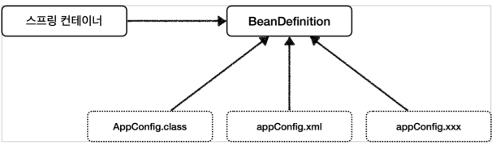
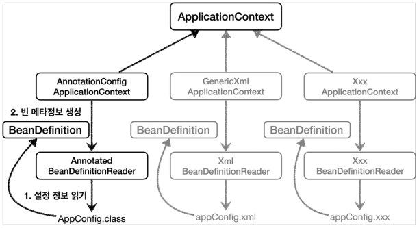

IoC 컨테이너와 빈      
========================

`Spring framework` 에서 말하는 `IoC`는 `DI`와 동일하다고 말한다.(Spring 레퍼런스에서 직접 언급)          
즉, **어떤 객체가 사용하는 의존 객체를 직접 만들어 사용하는게 아니라, 주입 받아 사용하는 방법을 말한다.**      
  
스프링은 `스프링 설정`과 `애플리케이션 구현`과 관련된 `Bean`들을 `스프링 컨테이너`에 저장한다.       

# 📗  스프링 IoC 컨테이너
스프링 IoC 컨테이너는 **✔BeanFactory**를 기반으로 구현된 구현체이다.         
애플리케이션 컴포넌트의 중앙 저장소의 역할을 맡고 있으며            
**✔빈 설정 소스**로 부터 **✔빈 정의**를 읽어들이고, 빈을 구성하고 제공한다.           
                  
## 📖 스프링 IoC(DI) 컨테이너 상세              
Spring은 '스프링 설정 및 '애플리케이션 구현'과 관련된 `빈(Bean)`들을 `Spring Container`에 저장한다.           
(`Spring Container` 는 'Servlet 컨테이너'와 비슷하다.)     
           
그리고 이러한 `Spring Container`의 종류는 크게 2가지가 있다.    
       
1. BeanFactory    
2. ApplicationContext   

### 📄 BeanFactory     
스프링 설정 파일에 등록된 `Bean`을 생성하고 관리하는 가장 기본적인 컨테이너 기능만 제공한다.        
처음부터 객체를 생성하지 않고, 클라이언트의 요청(Lookup)에 의해서만 `Bean`이 생성되는 **지연로딩 방식을 사용한다.**        
일반적인 스프링 프로젝트에서 `BeanFactroy`를 사용할 일은 거의 없다.          
            
### 📄 ApplicationContext     
`BeanFactory`를 상속받고 있다. (인터페이스간의 상속, `HierarchicalBeanFactory`)       
이외에도 `ApplicationEventPublisher`, `EnvironmentCapable`,   `HierarchicalBeanFactory`, `ListableBeanFactory`,           
`MessageSource`, `ResourceLoader`, `ResourcePatternResolver`등의 인터페이스를 구현하고 있다.      
              
'컨테이너식'으로 동작하며 `빈 처리 로직`외에도       
`트랜잭션 관리`나 `리소스 로딩 기능` 그리고 `메시지 기반의 다국어 처리`과 같은 다양한 기능을 지원한다.          
        
**메시지 소스를 활용한 국제화 기능**         
한국에서 들어오면 한국어로, 영어권에서 들어오면 영어로         
출력 파일을 여러 개로 분리해서 들어온 IP에 따라 알맞는 언어로 처리한다.        
   
**환경변수**     
로컬, 개발, 운영등을 구분해서 처리   

**애플리케이션 이벤트**         
이벤트를 발행하고 구독하는 모델을 편리하게 지원  

**편리한 리소스 조회**         
파일, 클래스패스, 외부 등에서 리소스를 편리하게 조회    
                  
`BeanFactory` 같은 경우, 빈을 관리하는 기본적인 역할만 수행하기에               
**대부분의 스프링 프로젝트는 `ApplicationContext` 유형의 `Spring Container`를 이용한다.**                   
  

## 📖 빈 설정 소스
### 📄 XML 기반
```xml
<?xml version="1.0" encoding="UTF-8"?>
<beans xmlns="http://www.springframework.org/schema/beans"
       xmlns:xsi="http://www.w3.org/2001/XMLSchema-instance"
       xsi:schemaLocation="http://www.springframework.org/schema/beans http://www.springframework.org/schema/beans/spring-beans.xsd">

    <bean id="memberService" class="hello.core.member.MemberServiceImpl">
        <constructor-arg name="memberRepository" ref="memberRepository"/>
    </bean>

    <bean id="memberRepository" class="hello.core.member.MemoryMemberRepository"/>

    <bean id="orderService" class="hello.core.order.OrderServiceImpl">    <!--빈 등록-->
        <constructor-arg name="memberRepository" ref="memberRepository"/> <!--필요한 연관 빈 생성자 주입 받겠다고 선언-->
        <constructor-arg name="discountPolicy" ref="discountPolicy"/>     <!--필요한 연관 빈 생성자 주입 받겠다고 선언-->
    </bean>

    <bean id="discountPolicy" class="hello.core.discount.RateDiscountPolicy"/> 
</beans>
```

### 📄 자바 @Configuration 기반  
```java
@Configuration // 1. AppConfig를 빈 등록한다. 
public class AppConfig {

    @Bean // 2. IoC Container에서 @Bean이 붙은 메서드를 찾아 호출하고 결과값을 빈으로 등록한다.  
    public MemberService memberService() {
        System.out.println("call AppConfig.memberService");
        return new MemberServiceImpl(memberRepository());
    }
```   

### 📄 자바 @Component 기반
* @Controller
* @RestController
* @Service
* @Repository
* 등등..  

```java
@Component
public @interface Controller {
}

@Component
public @interface Service {
}

@Component
public @interface Configuration {
}
```
   
빈 등록이 가능한 이유는 내부에 `@Component`이 존재하기 때문이다.         
`@ComponentScan`이 `클래스 패스`를 기준으로 `@Component`이 붙은 클래스를 찾아 자동으로 빈 등록을한다.     
참고로 이렇게, 내부에서 `어노테이션을 보조하는 어노테이션`을 **메타 어노테이션**이라고도한다.       
        
## 📖 빈 정의(스프링 빈 설정 메타 정보 - BeanDefinition)      
**스프링은 `BeanDefinition`을 통해 XML, JAVA와 같은 다양한 설정 형식을 지원한다.**      

     


**`BeanDefinition`을 빈 메타 정보라고 말한다.**         
* **`@Bean`, `<bean>`당 각각 하나씩 메타 정보가 생성된다.**         
* `XML`을 읽어서 `BeanDefinition`구현체를 만들면 된다.   
* 자바 코드를 읽어서 `BeanDefinition`구현체를 만들면 된다.   
* 스프링 컨테이너는 이 메타 정보를 기반으로 스프링 빈을 생성한다.         
    * **스프링 컨테이너는 자바 코드인지, XML인지 몰라도 오로지 `BeanDefinition`구현체만 알면 된다.**      

|Property|Explained in…|
|---|---|
|Class|Instantiating Beans|
|Name|Naming Beans|
|Scope|Bean Scopes|
|Constructor arguments|Dependency Injection|
|Properties|Dependency Injection|   
|Autowiring mode|Autowiring Collaborators|  
|Lazy initialization mode|Lazy-initialized Beans|  
|Initialization method|Initialization Callbacks|   
|Destruction method|Destruction Callbacks|      
     
* **BeanClassName:** 생성할 빈의 클래스 명(자바 설정 처럼 팩토리 역할의 빈을 사용하면 없음)
* **factoryBeanName:** 팩토리 역할의 빈을 사용할 경우 이름, 예) appConfig
* **factoryMethodName:** 빈을 생성할 팩토리 메서드 지정, 예) memberService
* **Scope:** 싱글톤(기본값)
* **lazyInit:** 스프링 컨테이너를 생성할 때 빈을 생성하는 것이 아니라, 실제 빈을 사용할 때 까지 최대한 생성을 지연처리 하는지 여부  
* **InitMethodName:** 빈을 생성하고, 의존관계를 적용한 뒤에 호출되는 초기화 메서드 명    
* **DestroyMethodName:** 빈의 생명주기가 끝나서 제거하기 직전에 호출되는 메서드 명    
* **Constructor arguments, Properties:** 의존관계 주입에서 사용한다. (자바 설정 처럼 팩토리 역할의 빈을 사용하면 없음)     
  
`빈 설정`은 이름 그대로 **빈을 어떠한 설정을 가지고 만들것이냐**에 대한 명세이다.          
그러니 너무 어렵게 생각하지 말고 **빈 설정**이라고만 이해를 하자      
   
그렇다면, `자바`와 `XML`에서 빈을 생성할 때 어떻게 설정 값을 주는지 않아보자    
   
### 📄 XML 기반
```xml
<?xml version="1.0" encoding="UTF-8"?>

<beans xmlns="http://www.springframework.org/schema/beans"
    xmlns:xsi="http://www.w3.org/2001/XMLSchema-instance"
    xsi:schemaLocation="http://www.springframework.org/schema/beans
    http://www.springframework.org/schema/beans/spring-beans-3.0.xsd">

   <!-- A simple bean definition -->
   <bean id="..." class="...">
   </bean>

   <!-- A bean definition with lazy init set on -->
   <bean id="..." class="..." lazy-init="true">
   </bean>

   <!-- A bean definition with initialization method -->
   <bean id="..." class="..." init-method="...">
   </bean>

   <!-- A bean definition with destruction method -->
   <bean id="..." class="..." destroy-method="...">
   </bean>

</beans>
```
`<bean> 태그`의 프로퍼티 값으로 `알맞는 definition 과 값`을 넣어주면 된다.     
   
### 📄 자바 기반  
**Bean 어노테이션 내부**
```java
@Target({ElementType.METHOD, ElementType.ANNOTATION_TYPE})
@Retention(RetentionPolicy.RUNTIME)
@Documented
public @interface Bean {

	@AliasFor("name")
	String[] value() default {};

	@AliasFor("value")
	String[] name() default {};
  
	@Deprecated
	Autowire autowire() default Autowire.NO;
  
	boolean autowireCandidate() default true;
	String initMethod() default "";
	String destroyMethod() default AbstractBeanDefinition.INFER_METHOD;
}
```
어노테이션 내부는 위와 같다.   
어노테이션 메서드처럼 정의하는 부분이 바로 프로퍼티(속성)을 정의하는 부분이다.  
이를 실제 코드를 보면 아래와 같다.  

```java
class Foo {
    public void init() {
        // initialization logic
    }
}
@Configuration
public class AppConfig {
    @Bean(initMethodName="init")
    public Foo foo() {
        return new Foo();
    }
}
```

### 📄 BeanDefinitionReader
`BeanDefinition` 인터페이스를 구현한 클래스들은        
`BeanDefinitionReader`인터페이스를 구현한 구현체를 의존하고 있다.                    

          
           
`BeanDefinitionReader` 인터페이스는 설정파일(자바,xml,..등등)에서 정보를 읽는 역할을 한다.            
즉, **설정파일을 기반으로 `BeanDefinition`을 생성하는 역할을 한다.(`Bean`의 메타정보 읽기)**        
    
* `AnnotationConfigApplicationContext`는 `AnnotatedBeanDefinitionReader`를 사용해서     
  `AppConfig.class`를 읽고, `BeanDefinition`을 생성한다.      
* `GenericXmlConfigApplicationContext`는 `XmlBeanDefinitionReader`를 사용해서     
  `AppConfig.xml`을 읽고, `BeanDefinition`을 생성한다.       
* 새로운 형식의 설정 정보가 추가되면, `XxxBeanDefinitionReader`를 만들어서 `BeanDefinition`을 생성하면 된다.  


**정리**
```
BeanDefinitionReader 구현체가 해당 클래스를 통해 정보를 읽어들어와          
BeanDefinition이라는 메타데이터를 만들고, 이를 통해 다시 객체를 새로 생성한다.
```
* `BeanDefinition`에 대해서는 너무 깊이있게 이해하기 보다는,     
  스프링이 다양한 형태의 설정 정보를 `BeanDefinition`으로 추상화해서 사용하는 것 정도만 이해하자      
* 가끔 `BeanDefinition` 이라는 것이 보일 때가 있다.    
  이때 이러한 메커니즘을 떠올리면 된다.   
     
### 빈
● 스프링 IoC 컨테이너가 관리 하는 객체.
● 장점
○ 의존성 관리
○ 스코프
■ 싱글톤: 하나
■ 프로포토타입: 매번 다른 객체
○ 라이프사이클 인터페이스


이러한, 스프링 컨테이너는 `Servlet 컨테이너`와 비슷하며 2가지 종류가 존재한다.        


   
`BeanFactory` 같은 경우, 빈을 관리하는 기본적인 역할만 수행하기에        
우리가 스프링에서 사용하는 컨테이너는 대부분 `ApplicationContext`를 상속받은 구현체들이다.   
      
* ClassPathXmlApplicationContext (XML)
* AnnotationConfigApplicationContext (Java)

**빈 설정**    
* 빈 명세서  
* 빈에 대한 정의를 담고 있다.     

     
[빈팩토리와 라이프사이클](https://howtodoinjava.com/spring-core/spring-bean-life-cycle/)   

# 📕 ApplicationContext 와 다양한 빈 설정 


# 📒 @Autowired 
빈 라이프 사이클에서 사용되는 `BeanPostProcessor` 인터페이스 구현체 AutoWiredAnnotationBeanPost 에 의해 가능한것이다.     

`BeanPostProcessor`는 빈을 만든 다음에, 빈의 초기화 과정 전후로 부가적인 작업을 할 수 있게 해주는 또다른 라이프 사이클 콜백이다.   
즉, 처음 빈이 만들어지고 init 메서드를 실행하기 전후로 콜백을 실행해서 의존 관계를 맺는것이다.      
 
ApplicationContext의 빈팩토리가, `BeanPostProcessor`를 찾는다.      
등록된 빈들 중에는 `AutoWiredAnnotationBeanPost`를 찾게 될 것이다.      
다른 일반적인 빈들에게 `AutoWiredAnnotationBeanPost`를 적용하는 것이다.   


[https://howtodoinjava.com/spring-core/spring-bean-life-cycle/](https://howtodoinjava.com/spring-core/spring-bean-life-cycle/)   
